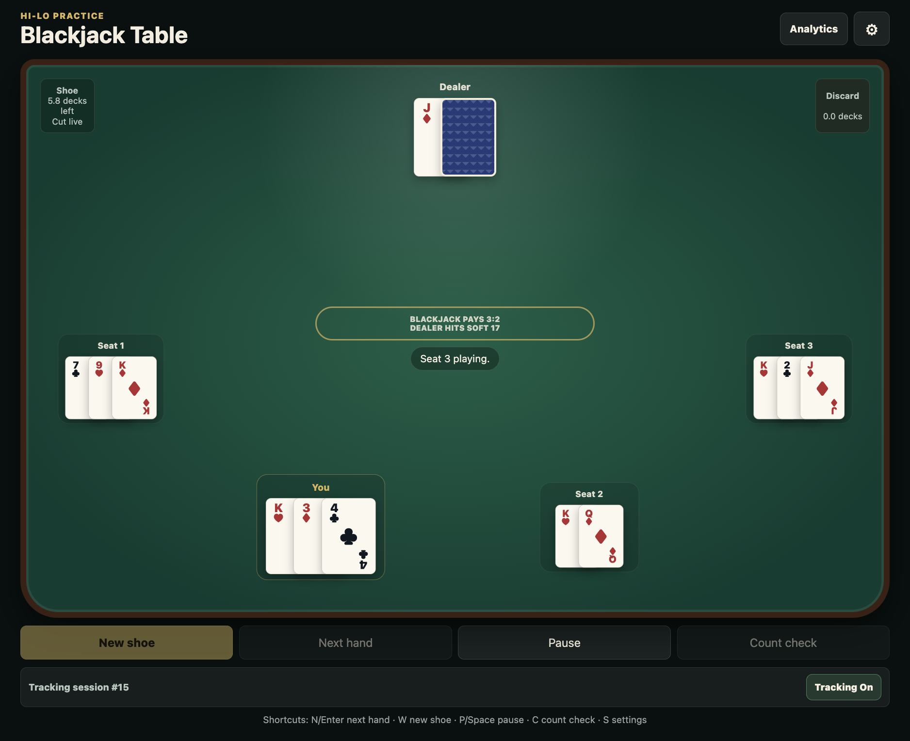

# Blackjack Practice

A mobile-friendly blackjack trainer for practicing Hi-Lo card counting and basic
strategy, with four customizable drills: **Table Practice**, **Flash Count**,
**Basic Strategy**, and **Deck Countdown**. Practice data stays private in a
local SQLite database with detailed analytics for tracking accuracy and
progress.



## Architecture

This is an npm-workspaces monorepo with a clean front-end / back-end split and a shared type package:

```
blackjack-practice/
├── shared/   @blackjack/shared — TypeScript types shared by client and server
├── server/   @blackjack/server — Express + better-sqlite3 REST API
├── client/   @blackjack/client — React + Vite single-page app (client-side routing)
├── sim/      Native strategy generator and aggregate strategy evaluator
└── data/     blackjack.sqlite (created on first run; git-ignored)
```

- **Backend** — Express (TypeScript) serving a JSON API under `/api`, persisting to SQLite via the `better-sqlite3` driver. Routes are split by resource (`sessions`, `events`, `strategy`, `analytics`); analytics aggregation lives in `server/src/services`. In development, non-API browser routes on the API port redirect to the Vite UI so there is one user-facing app URL. In production, the server also serves the built client and falls back to `index.html` so deep links work.
- **Frontend** — React + Vite. Each drill is a route with its own URL (see below). Game logic lives in framework-agnostic engine modules (`client/src/features/*`) driven by React. Settings persist to `localStorage`.
- **Native simulation** — C++/OpenMP strategy generation and complete-round aggregate evaluation with versioned JSON inputs and compressed artifacts.
- **Shared** — request/response DTOs, domain types (cards, Hi-Lo), strategy and settings shapes, used by both sides for end-to-end type safety.

### Routes

| Drill               | Path              |
| ------------------- | ----------------- |
| Home (drill picker) | `/`               |
| Table Practice      | `/table-practice` |
| Flash Count         | `/flash-count`    |
| Basic Strategy      | `/basic-strategy` |
| Deck Countdown      | `/deck-countdown` |

Routing uses the History API, so the browser back/forward buttons work and each drill is bookmarkable and shareable.

## Quick start

Requires Node 18+ and `sqlite3` on `PATH`.

```bash
git clone https://github.com/kasikritc/blackjack-practice.git
cd blackjack-practice
npm install
npm run dev
```

`npm run dev` builds the shared types, then runs the API server and Vite dev server together. During development there is one user-facing UI URL:

```text
http://localhost:5174
```

Port `5174` is the Vite UI and updates as source files change. Port `5173` is the internal API server in development; do not use it as the UI while editing features. If you open a browser route such as `http://localhost:5173/deck-countdown` during development, the server redirects it to the matching `5174` URL.

On this machine, `play_blackjack_practice` starts the dev stack in the background and prints a single `Open:` URL, including a LAN URL for another device when available.

The Vite dev server proxies `/api` requests to the Express server. The SQLite schema is created and migrated automatically on first run; the database lives at `data/blackjack.sqlite` (git-ignored). Override its location with `BLACKJACK_DB_PATH`.

### Production build

```bash
npm run build   # builds shared → server → client
npm start       # serves the built client + API on http://localhost:5173
```

## Scripts

| Command              | Description                             |
| -------------------- | --------------------------------------- |
| `npm run dev`        | Run API server + Vite UI in watch mode  |
| `npm run build`      | Build all three workspaces              |
| `npm start`          | Serve the production UI + API on `5173` |
| `npm run typecheck`  | Type-check server and client            |
| `npm run lint`       | Lint the whole repo                     |
| `npm run format`     | Format with Prettier                    |
| `npm run sim:check`  | Build/test/smoke the native simulator   |
| `npm run eval:smoke` | Smoke-test both evaluator shoe modes    |

The CLI-first aggregate evaluator is documented in [`docs/strategy-evaluator.md`](./docs/strategy-evaluator.md). It accepts strict versioned strategy packages, including exported saved charts, and produces reproducible compressed run artifacts.

On this machine, `play_blackjack_practice` launches the dev servers in the background and prints the one URL to open. Use `5174` for the dev UI; `5173` is the API/prod-build port. If available, `./start-blackjack-practice.sh` / `./stop-blackjack-practice.sh` and `bin-*` wrappers follow the same dev-server split.

## Drills

- **Table Practice** — real shuffled shoes with configurable deck count and penetration, automated other players and dealer flow, a visible-card-only Hi-Lo running count (the dealer hole card counts only when revealed), and random/interval/end-of-round/manual count quizzes.
- **Flash Count** — a configurable number of cards (default 2–5) flash briefly then hide; call the Hi-Lo count of just that hand. Each round is independent and resets the count.
- **Basic Strategy** — two-card decision drills against every dealer upcard, using selectable rule profiles, basic-strategy charts, and focus subsets (pairs only, softs only, dealer 2–6, etc.) seeded by the server.
- **Deck Countdown** — flip through complete shuffled decks and submit the ending Hi-Lo count, with configurable deck count, cards per flip, mode, speed, stopwatch, and flip animations.

### Controls & shortcuts

- Table Practice: **Next hand** (`N`/`Enter`), **New shoe** (`W`), **Pause/Resume** (`P`/`Space`), **Count check** (`C`), **Settings** (`S`).
- Flash Count: **Deal** (`N`/`Enter`).
- Basic Strategy: **Next prompt** (`N`/`Enter`); actions **Hit** (`A`), **Stand** (`S`), **Double** (`D`), **Split** (`F`), **Surrender** (`R`), **Insurance** (`E`).
- Deck Countdown: **Start countdown** / **Flip card** (`Enter` in manual mode). Automatic mode advances on the configured interval.
- In the count prompt, `D` toggles the count sign and `Enter` submits / continues.

## Analytics

Practice analytics are stored locally in `data/blackjack.sqlite`. Tracking is on by default; a session row is created on the first recorded event. Each drill surfaces its own analytics panel (mastery score, accuracy, streaks, trends, breakdowns). Table and Flash data are stored in separate tables, so resetting one does not affect the other.

The REST contract and SQLite schema are unchanged from the original single-file app, so analytics collected before this refactor remain valid. See [`docs/analytics.md`](./docs/analytics.md) for the full data dictionary. In analytics fields, `number_of_other_players` counts automated seats only, not the user's seat.
